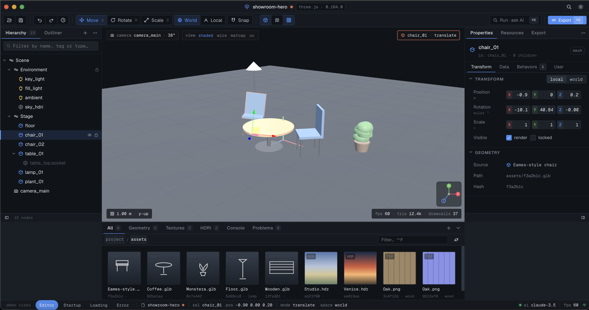
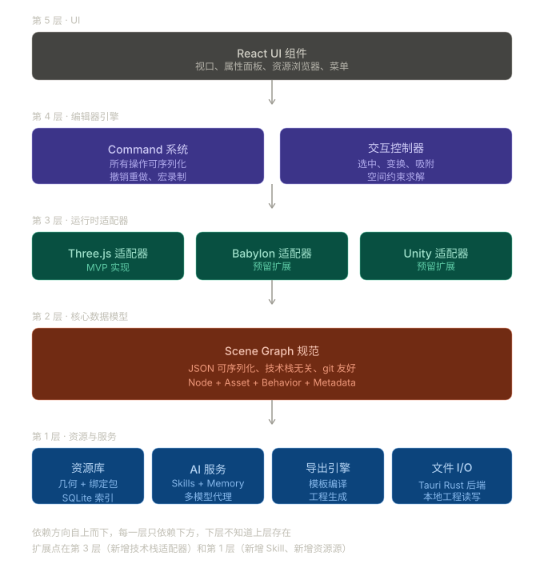
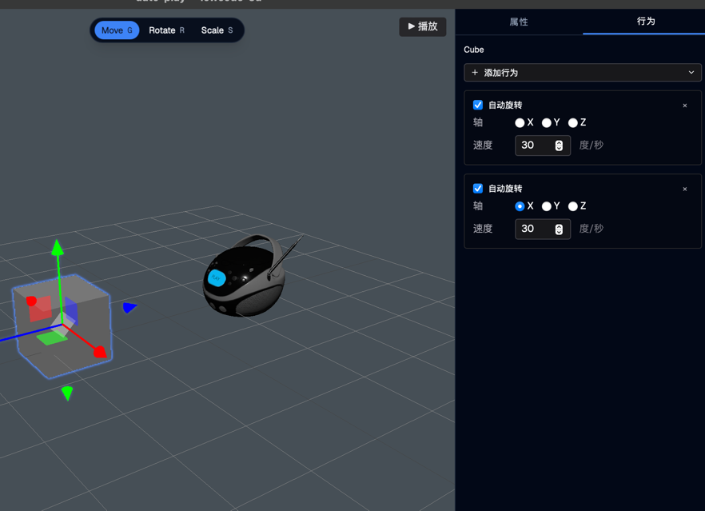

<div align="center">

# lowcode-3d

**AI-assisted low-code platform for the Web 3D stack.**
Arrange a scene visually, export production-ready Three.js code.

[](https://github.com/longyi-xw/lowcode-3d/actions/workflows/ci.yml)
[](LICENSE)
[](#status)



</div>

---

## Why

3D on the web is everywhere, but the gap between **a designer's intent** and
**Three.js production code** is still hours of glue work — boilerplate setup,
material wiring, light placement, asset loading. lowcode-3d closes that gap
by giving you a desktop editor that produces real Three.js code, plus an
optional AI layer for natural-language scene edits driven by your own API key.

## Status

> **You are here**: pre-`v0.1.0` — Phase 0-2 shipped (geometry / lights / cameras / .glb import / Vite + standalone code export); v0.5 行为系统 framework + auto-rotate shipped ahead of schedule. Phase 3 (polish & release) in progress towards v0.1.0.

| Milestone                                                                                 | What lands                                                                                           | Status                             |
| ----------------------------------------------------------------------------------------- | ---------------------------------------------------------------------------------------------------- | ---------------------------------- |
| [`v0.0.1-scaffold`](https://github.com/longyi-xw/lowcode-3d/releases/tag/v0.0.1-scaffold) | Tauri + Vite + React + Tailwind + shadcn + i18n + Zustand + ESLint + CI                              | ✅ shipped                         |
| `v0.1.0-mvp`                                                                              | Scene Graph · Three.js viewport · transform gizmos · .glb import · code export · behaviors framework | 🟡 Phase 3 polish in progress      |
| `v0.2`                                                                                    | Asset browser · material editor · settings persistence                                               | ⏳ planned                         |
| `v0.3`                                                                                    | AI Skills · natural-language scene edits                                                             | ⏳ planned                         |
| `v0.4`                                                                                    | Spatial snapping (socket system)                                                                     | ⏳ planned                         |
| `v0.5`                                                                                    | Behavior library (auto-rotate ✅, hover-highlight, click-trigger, …)                                 | 🟡 partial — framework + 1 shipped |
| `v1.0`                                                                                    | Multi-runtime adapter (Babylon.js validation)                                                        | ⏳ planned                         |
| `v1.x`                                                                                    | react-three-fiber, Unity adapters                                                                    | ⏳ planned                         |

Detailed sub-stage tracking lives in [`docs/roadmap.md`](docs/roadmap.md). The
five-layer architecture this scaffold is laid against lives in
[`design/framework/architecture.md`](design/framework/architecture.md), and the
canonical Scene Graph format / adapter interface live in
[`docs/scene-graph-spec.md`](docs/scene-graph-spec.md) and
[`docs/adapter-guide.md`](docs/adapter-guide.md).

## What works today

Concrete user story coverage as of pre-v0.1:

- **Create** a new project, choose `three.js` runtime; save / open / close from disk (atomic folder swap, git-friendly per-node files).
- **Edit** transforms via gizmo or numeric panel; pick by canvas click; undo/redo with a 500ms gesture merge window.
- **Compose** a scene with meshes, lights (directional / point / spot / ambient), cameras, helpers (grid / axes), and `.glb` imports (content-addressed `assets/{sha256}.glb`).
- **Behaviors**: add auto-rotate bindings on any node; edit axis + speed; toggle Play to preview; Stop restores transform.
- **Export** to a Vite project (`pnpm install && pnpm dev`) or a standalone HTML viewer (`python -m http.server`). Exported code includes the same auto-rotate runtime.

The full release matrix and sub-stage tracking live in [`docs/roadmap.md`](docs/roadmap.md).

## Stack

- **Desktop shell** — [Tauri 2.x](https://tauri.app/) (Rust backend, web frontend)
- **Frontend** — React 18 + TypeScript 5 (strict + `noUncheckedIndexedAccess`) + Vite 5
- **3D** — Three.js (MVP) · adapter interface ready for Babylon.js / R3F / Unity
- **State** — Zustand + Immer, with a Command bus for undo/redo
- **UI** — Tailwind CSS 3 + shadcn/ui (new-york) · Geist + Geist Mono variable fonts
- **i18n** — react-i18next · zh-CN + en-US bundled, key-typed via TS module augmentation
- **Storage** — SQLite (project index) · JSON folder (project format, git-friendly)
- **Quality** — ESLint 9 (flat) · Prettier · Vitest · husky + lint-staged + commitlint · GitHub Actions

## Architecture



Each `src/<layer>/` directory only depends on layers below it. See
[`CONTRIBUTING.md`](CONTRIBUTING.md#2-repository-layout) for the directory map
and the rules around adding new code.

## Current implementation

The editor as of pre-v0.1 — behaviors framework + auto-rotate + Play/Pause toggle shipped in PRs [#20](https://github.com/longyi-xw/lowcode-3d/pull/20) and [#21](https://github.com/longyi-xw/lowcode-3d/pull/21):



## Prototype

Annotated walkthrough in [`design/prototype/`](design/prototype/) — the editor
(`img.png`), Settings (`img_1`–`img_7`), Startup (`img_8`), Loading (`img_9`),
and Error (`img_10`). The dev build of the scaffold ships a `demo views`
bar at the bottom of the window that cycles through Startup / Loading /
Editor / Error shells so the prototype states stay verifiable as code lands.

## Development

Prerequisites:

- Node 20+ (pinned in [`.nvmrc`](.nvmrc))
- pnpm 9+ (declared in `packageManager`; `corepack enable` will pick it up)
- Rust stable (rustup recommended; Homebrew also works)
- Xcode Command Line Tools on macOS

```bash
pnpm install
pnpm tauri dev      # desktop window with the prototype scaffolding
pnpm dev            # frontend-only at http://localhost:1420
pnpm test           # vitest (jsdom)
pnpm lint           # eslint .
pnpm typecheck      # tsc --noEmit
pnpm build          # frontend production bundle
```

## Releases

Pushing a `v*` tag triggers
[`.github/workflows/release.yml`](.github/workflows/release.yml), which runs
`tauri build` on macOS (universal), Windows, and Linux runners and drafts a
GitHub Release with the resulting `.dmg` / `.msi` / `.exe` / `.deb` /
`.AppImage` artifacts attached.

> First real release needs production icons. Run
> `pnpm tauri icon path/to/logo-1024.png` once you have a 1024×1024 source
> image — it generates all platform-specific formats into `src-tauri/icons/`.
> Then flip `bundle.active` to `true` in `src-tauri/tauri.conf.json`.

## Contributing

Branch naming, Conventional Commits, and the PR template live in
[`CONTRIBUTING.md`](CONTRIBUTING.md). Short version: feature branches off
`main`, lint + typecheck + test must be green, and any new user-facing
string must land in both `src/i18n/locales/en-US/` and
`src/i18n/locales/zh-CN/` in the same commit.

## License

[MIT](LICENSE) © 2026 lowcode-3d contributors.
